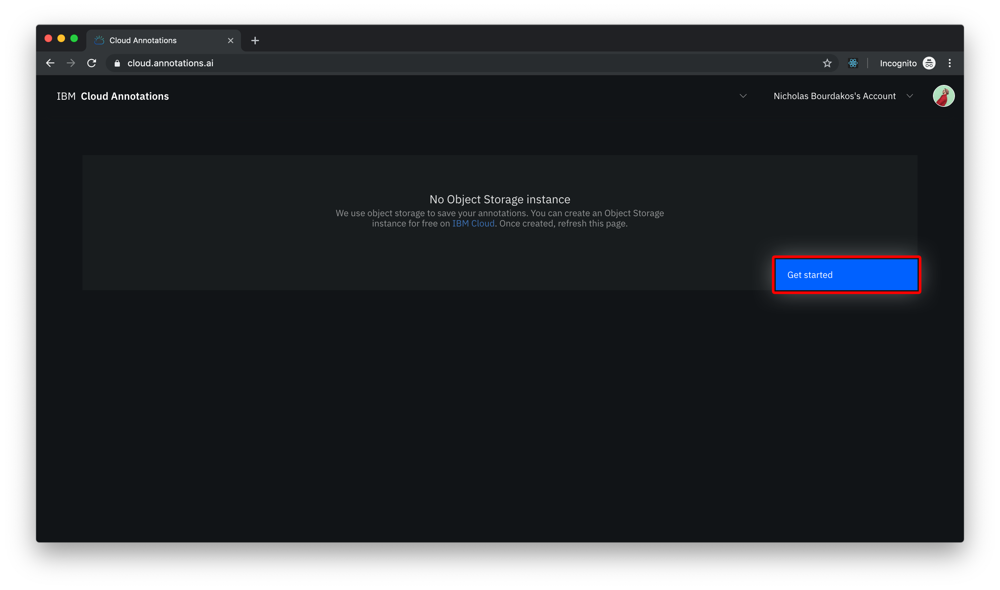
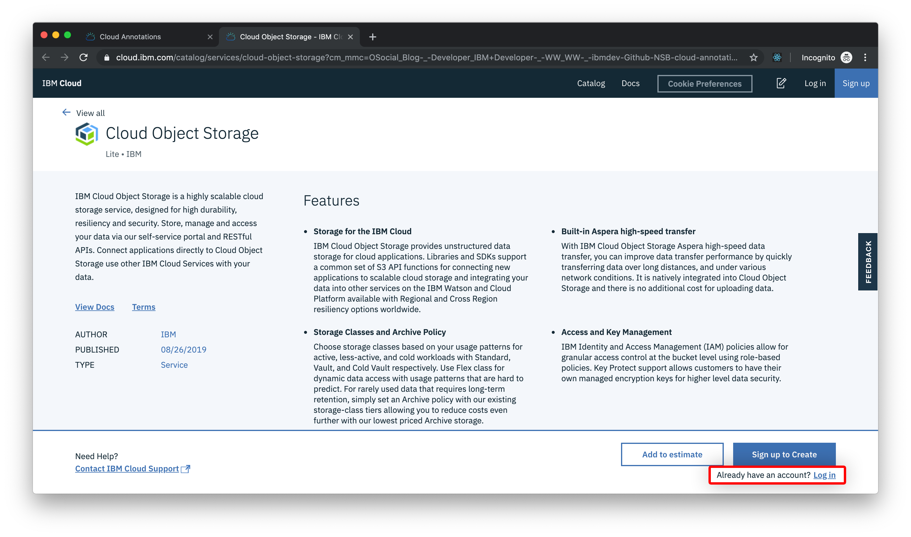

To train an object detection model we need a dataset of images and bounding box annotations.

To ease the creation of our annotations, we can use [Cloud Annotations](https://cloud.annotations.ai), a web GUI that sits on top of an object storage that allows us to upload photos and associate them with annotations.

Using an object storage gives us a reliable place to keep our training data. It also opens up the potential for collaboration, letting a team to simultaneously annotate the dataset in real-time.

IBM Cloud offers a lite tier of object storage, which includes 25 GB of storage for free. (this is what we will be using throughout the tutorial)

To use Cloud Annotations just navigate to [cloud.annotations.ai](https://cloud.annotations.ai) and click **Continue with IBM Cloud**.

Once logged, if we don't have an object storage instance, it will prompt us to create one. Click **Get started** to be directed to IBM Cloud, where you can create a free object storage instance.

You might need to re-login to IBM Cloud to create a resource.

Choose a pricing plan and click **Create**, then **Confirm** on the following popup.

Once your object storage instance has been provisioned, navigate back to [cloud.annotations.ai](https://cloud.annotations.ai) and refresh the page. 

We will be storing our files and annotations in something called a **bucket**, we can create one by clicking **Start a new  project**.

Give the bucket a unique name.

After we create and name our bucket, it will prompt us to choose an annotation type. We need to choose **Localization**. This allows us to draw bounding box rectangles on our images.

## Training data best practices
* The model we will be training is optimized for photographs of objects in the real world. They are unlikely to work well for x-rays, hand drawings, scanned documents, receipts, etc.

* The training data should be as close as possible to the data on which predictions are to be made. For example, if your use case involves blurry and low-resolution images (such as from a security camera), your training data should be composed of blurry, low-resolution images. In general, you should also consider providing multiple angles, resolutions, and backgrounds for your training images.

* The model we will be training can't generally predict labels that humans can't assign. So, if a human can't be trained to assign labels by looking at the image for 1-2 seconds, the model likely can't be trained to do it either.

* We recommend at least 50 training images per label for a usable model, but using 100s or 1000s would provide better results.

* The model we will be training resizes the image to 300x300 pixels, so keep that is mind when training the model with images where one dimension is much longer than the other.

## Labeling the data
1. Upload a video or many images

2. Create the desired labels

3. Start drawing bounding boxes

## &nbsp;
> **📁 [Sample Training Data](https://ibm.box.com/v/counting-cars-training)**
